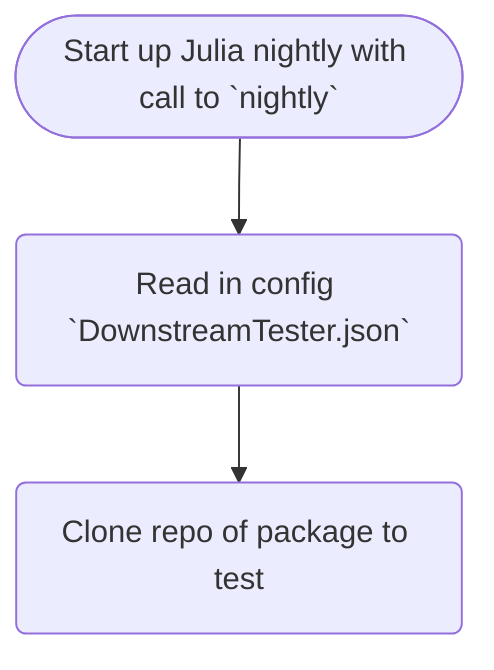

# DownstreamTester.jl

This package offers a toolkit for performing and tracking tests of 
downstream packages depending on the current package as well as tests against 
Julia nightly.

The **planned** nightly workflow is as follows

