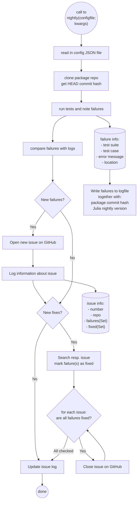

# DownstreamTester.jl

This package offers a toolkit for performing and tracking tests of 
downstream packages depending on the current package as well as tests against 
Julia nightly.

Currently, only the nightly workflow is implemented.

The nightly workflow is as follows

